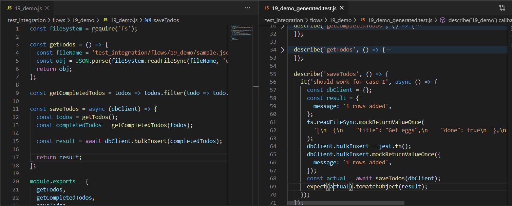

# unit-test-recorder

Record unit tests as you use your application.



TL;DR:  *Jest snapshots on steroids*

## Installation

```sh
npm i -g unit-test-recorder
```

## Usage

### Procedure

1. Make sure you are using git and there are no uncommited changes.
2. Run `unit-test-recorder <your entrypoint>.js`. Usually it is `index.js` or `server.js`. UTR will require this file as module. Make sure you are not using [require.main === module](https://stackoverflow.com/a/6398335/1217998).
3. It will now crawl through your project and hook itself into all your files. It will use `git reset` to revert it when testing is done.
4. As you use your application, it will record activity for all your exported functions.
5. Press `Q` or `Ctrl + C` key on the keyboard to safely stop the recording and your application and start generating the tests.
6. Run your favourite linter/prettier to clean up the generated test code.

### Notes

* **IMPORTANT**: Serialization of JSONs in the process of recording may cause slowdown. The APIs may take considerably longer to execute. (2-10x)
* All local modules are mocked but external modules must be whitelisted. e.g. Create a file `whitelist.json` with content `{ "axios": true }` and use the flag `--whitelist=./whitelist.json` to record mocks for functions used by `axios`.
* The `./utr_activity` directory contains all the snapshots which are used to generate the code for test cases. If UTR finds an existing directory, it will load these snapshots as state. This enables the user to record in multiple sessions. It can be deleted after code has been generated.

### Flags

Except `entrypoint` all are optional.

| Flag name | Description |
| --------- | ------------ |
| entrypoint (positional) | Path to entrypoint of your application |
| --only | Run only on these files (relative path, comma separated, supports javascript RegExp) |
| --except | Dont run on these files (relative path, comma separated, supports javascript RegExp) |
| --whitelist | Path to `whitelist.json` |
| --max-tests | Maximum number of generated tests per function. Type -1 for infinity. Default 5. |
| --output-dir | The directory in which the tests would be written to. |
| --test-ext | Extension for test files (spec.js/test.ts) |
| --size-limit | Objects larger than this limit will be moved to a different file |
| --max-stack-depth | Properties of a JSON, at a depth higher than this, will not be recorded. Default 7. |

### Environment variables

| Environment variable name | Description |
| --------- | ------------ |
| UTR_EXPERIMENTAL_ALS | Set this flag to use `AsyncLocalStorage` instead of `cls-hooked`. (Experimental, requires nodejs `v13.10+`) |

## Mechanism

Lets take this function as an example

```js
const foo = (a, b) => a + b
```

UTR uses babel to explicitly instrument it to

```js
const foo = (...p) => recorderWrapper(
    { name:'foo', fileName:'bar' },
    (a, b) => a + b,
    ...p
  )
```

The `recorderWrapper` function is provided by UTR. The function below is a simplified version of its implementation.

```js
const recorderWrapper = (meta, fn, ...p) => {
  const result = fn(...p)
  Recorder.record({ meta, result, params: ...p })
  return result;
}
```

This records all calls to this function in a state. Here is a simplified representation.

```json
{
  "fileName":{
    "functionName":{
      "captures":[
        { "params": [1, 2], "result": 3 },
        { "params": [2, 3], "result": 5 },
      ]
    }
  }
}
```

Now using string interpolation, we can generate test cases.

```js
describe('fileName', () => {
  describe('functionName', () => {
    it('test 1', () => {
      expect(foo(1,2)).toEqual(3);
    })
    it('test 2', () => {
      expect(foo(2,3)).toEqual(5);
    })
  })
})
```

## Planned features

* Higher order functions
* class methods and JSX
* function methods
* Better typescript support (partial available)

## Typescript (work in progress)

* Make sure you have `ts-node` installed.
* Run using `ts-unit-test-recorder` instead of `unit-test-recorder`

If that doesnt work

* Compile typescript into javascript
* Run `unit-test-recorder dist/index.js --output-dir=test --test-ext=test.ts`

## Troubleshooting

* UTR is still early in development and may be unstable. Users are recommended to use the `--only` flag to run UTR on a few files at a time.

## Similar software

1. [UIRecorder](https://uirecorder.com/) - Similar idea but for java
2. [redux-test-recorder](https://github.com/conorhastings/redux-test-recorder) - Redux middleware which records the states and actions
3. [test-recorder](https://github.com/QuantumInformation/test-recorder) - Frontend only
4. [pythoscope](https://github.com/mkwiatkowski/pythoscope) - Python, boilerplate only
